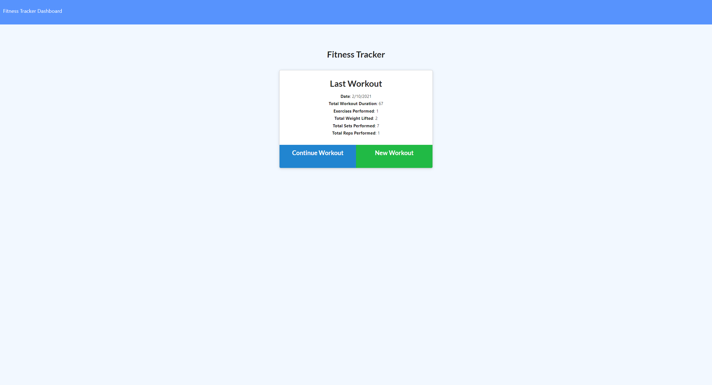
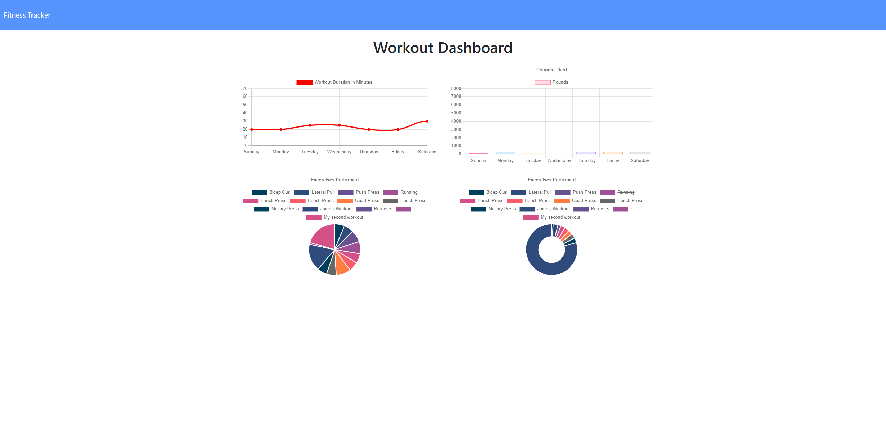

# Workout-Tracker

## About the Project
Workout tracker is an app that allows the user to easily track workouts. Create a workout easily from the home page, set the details, and it is stored in the database. From there the user can edit the workout, delete the workout, or view all workouts on the chart page.

## Installation
Run npm i to download required packages, connect to server and use the app.

## Built With
css

javascript

mongoDB

node.js

Mongoose
